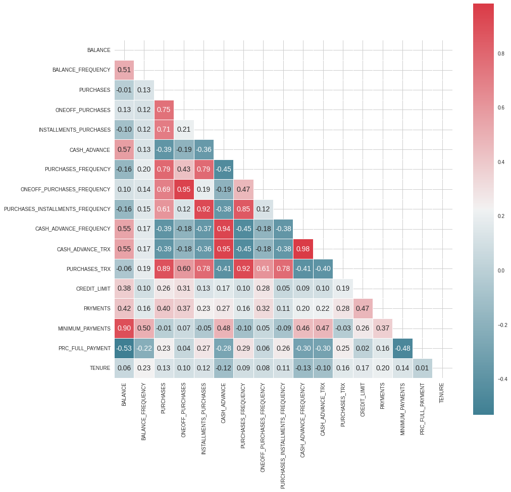
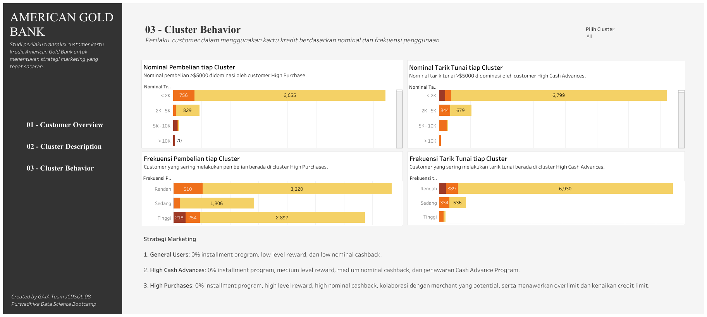

# **Credit Card Customer Segmentation**

### **Creator Profile** 
1. Gina Nur Rahmasari - ginanurahmasari@gmail.com | [LinkedIn](https://www.linkedin.com/in/gina-nur-rahmasari-4ab0a4b7/) | [GitHub](https://github.com/ginanurahmasari)
2. Herdiansyah Prihatna Putra - herdiansyahprihatna@gmail.com | [LinkedIn](https://www.linkedin.com/in/herdiansyahp/) | [GitHub](https://github.com/HerdiansyahPP)
3. Saniyya Hanan Rosyida - saniyya.rosyida@gmail.com | [LinkedIn](https://www.linkedin.com/in/saniyya-hanan-rosyida/) | [GitHub](https://github.com/saniyyarosyida)

### **Content**
1. Business Problem Understanding
2. Data Understanding
3. Data Preprocessing
4. Modeling and Evaluation
5. Conclusion
6. Recommendation
7. Business Implementation

## **I. Business Problem Understanding**
#### **Context**
Dilansir dari [US Bank](https://www.usbank.com/credit-cards/how-credit-cards-work.html#:~:text=Credit%20cards%20offer%20you%20a,loan%20amount%20in%20the%20future.), kartu kredit merupakan instrumen yang dikeluarkan oleh pihak Bank atau lembaga keuangan sejenis yang memungkinkan pemilik kartu kredit untuk melakukan pembayaran non tunai, mentransfer saldo dan menarik uang tunai menggunakan uang milik bank yang tertera dalam sebuah kartu kredit. Tiap jenis kartu kredit memiliki limit saldo yang berbeda-beda. Kepemilikan jenis kartu kredit biasanya disesuaikan dengan penghasilan customer, riwayat penggunaan kartu kredit dan jumlah aset yang dimiliki. Semakin besar penghasilan dan kepemilikan aset, serta semakin loyal, konsumtif dan bertanggung jawab seorang customer dalam riwayat penggunaan kredit, akan memungkinkan bagi bank untuk memberikan limit kredit yang semakin besar atau bahkan tak terbatas. Setiap kegiatan transaksi yang dilakukan menggunakan kartu kredit wajib dibayarkan kembali kepada pihak bank di masa mendatang sesuai dengan tenggat waktu yang diberikan. Seorang customer dapat membayar tagihan kredit secara lunas atau dengan pembayaran minimum namun dikenakan bunga. Jika seorang customer terlambat/tidak membayar tagihannya, maka jumlah tagihannya akan dikenakan bunga dan denda oleh pihak bank dan jika hal ini terus terjadi akan beresiko untuk diturunkan limitnya atau di-blacklist. Dengan demikian, customer yang loyal, konsumtif, dan selalu membayar tagihan kreditnya menjadi kunci bagi pemberi kredit agar bisnis tetap berjalan lancar dan tidak terjadi kredit macet.

Berdasarkan survei yang dilakukan oleh [Forbes Advisor](https://www.forbes.com/advisor/credit-cards/credit-card-statistics/#:~:text=Most%20Common%20Types%20of%20Credit,52.8%25%20of%20cards%20in%20circulation.) pada Februari 2023, hanya 9% warga USA yang masih aktif menggunakan uang tunai untuk bertransaksi, 54% orang lebih memilih menggunakan kartu debit fisik atau virtual, dan 36% lainnya menggunakan kartu kredit fisik atau virtual. Hal ini membuktikan bahwa pola transaksi jual beli di masyarakat telah beralih dari tunai menjadi non tunai, sebab proses pembayarannya yang lebih simpel dan akurat. Beberapa alasan seseorang lebih memilih kartu kredit untuk bertransaksi adalah adanya credit reward, ingin membangun credit score, serta kenyamanan dan keamanan dalam bertransaksi. 4 kartu kredit yang paling umum digunakan di USA adalah Visa, Mastercard, American Express, dan Discover. 

Berdasarkan artikel [Money Geek](https://www.moneygeek.com/credit-cards/advice/how-credit-card-companies-make-money/) dan [Joe Resendiz](https://www.valuepenguin.com/how-do-credit-card-companies-make-money), Bank memperoleh keuntungan dari bisnis kartu kredit melalui :
- Bunga dan denda yang dikenakan ketika customer telat membayar tagihan.
- Bunga dari peminjaman baik sekali bayar, cicilan, maupun tunai.
- Biaya penarikan uang tunai / cash advance. Seringkali Bank membebankan biaya yang lebih tinggi untuk tarik tunai.
- Biaya transfer saldo dari satu kartu kredit ke kartu kredit lain.
- Biaya transaksi luar negeri.
- Biaya yang dibayarkan merchant untuk setiap barang/aset yang terjual melalui transaksi dengan kredit.

Bertumbuhnya jumlah pengguna kartu kredit dari tahun ke tahun menyebabkan persaingan bisnis kartu kredit semakin ketat. Pelanggan dapat dengan mudah beralih ke kartu kredit lain yang memiliki biaya keseluruhan paling rendah. Oleh karena itu, penting bagi perusahaan kartu kredit untuk memahami karakteristik pelanggannya kemudian membangun loyalitas dan perilaku konsumtif pelanggan berdasarkan karakteristiknya, sebab mempertahankan pelanggan yang sudah ada lebih murah dibandingkan dengan mendapatkan pelanggan baru. Dilansir dari [SendPulse](https://sendpulse.com/support/glossary/customer-loyalty), pelanggan yang loyal dalam menggunakan kartu kredit sangat penting bagi Bank karena pelanggan tersebut cenderung melakukan pembayaran dengan kredit secara berulang-ulang dan pengeluaran lebih besar saat liburan, sehingga lebih banyak menghasilkan keuntungan daripada pelanggan yang lebih memilih untuk bertransaksi non kredit.

#### **Problem Statement & Goals**
American Gold Bank adalah sebuah Bank penyedia layanan kartu kredit di USA. Bank tersebut ingin mengetahui karakteristik pelanggannya yang sudah ada kemudian menentukan strategi pemasaran yang tepat untuk dapat membangun loyalitas pelanggan dalam menggunakan produk mereka. Hal ini berguna agar penawaran produk/reward menjadi tepat sasaran sehingga kebutuhan dan kepuasan pelanggan dapat terpenuhi, Bank dapat membangun pelanggan yang masih kurang menguntungkan maupun yang sudah loyal menjadi lebih menguntungkan, serta Bank tidak membuang-buang waktu maupun biaya kepada pelanggan yang merugikan.

Jika pelanggan yang sudah ada tidak dipertahankan, pelanggan dapat beralih ke kartu kredit lain dan menyebabkan keuntungan bisnis menurun, citra bisnis buruk akibat penilaian dari pelanggan kurang baik, dan dalam jangka waktu panjang ketidakpuasan pelanggan akan memengaruhi respon pasar terhadap konten pemasaran yang diterbitkan sehingga membuat penetrasi produk ke pasar menjadi sulit dan Bank tidak dapat menghadapi persaingan perbankan.

#### **Analytic Approach (Model & Metric Evaluation)**
Selaku Data Scientist di American Gold Bank, kami akan menyelesaikan permasalahan ini dengan men-segmentasi pelanggan berdasarkan riwayat penggunaan kartu kreditnya. Dari sini, kita dapat melihat tingkat loyalitas, perilaku konsumtif dan tanggung jawab pelanggan saat membayar tagihan kredit. Oleh karena itu, model akan dibuat menggunakan metode clustering. Beberapa algoritma clustering yang akan digunakan adalah K-Means, Agglomerative dan DBSCAN (Density-based spatial clustering of applications with noise).

Metric evaluasi yang akan digunakan adalah silhouette score untuk setiap model. Metric silhouette score mengevaluasi model berdasarkan tingkat kemiripan sebuah data poin dengan clusternya sendiri terhadap cluster lain. Jika nilai silhouette score semakin mendekati angka 1, maka semakin jelas perbedaan antar tiap cluster / dapat menjadi tolak ukur untuk melihat apakah pelanggan kartu kredit telah benar-benar tersegmentasi dengan jelas berdasarkan perilaku penggunaan kredit. Jika pelanggan tersegmentasi dengan baik, maka pemberian dan penerapan strategi bisnis untuk tiap segmen pelanggan menjadi lebih tepat sasaran, sehingga dapat meminimalisir waktu, tenaga dan pengeluaran biaya yang sia-sia. Kami juga menggunakan membership untuk melihat jumlah anggota pada tiap cluster yang telah dibuat, sehingga penentuan model terbaik tak hanya berdasarkan nilai metric evaluasinya saja. Terkadang, ada model yang memiliki nilai evaluasi baik namun jumlah anggota pada tiap clusternya sangat jauh berbeda. Penggunaan membership dapat menghindari hal tersebut. Visualisasi boxplot dari hasil clustering juga akan menjadi pertimbangan untuk melihat perbedaan antara 1 cluster dengan cluster lain. Model dengan silhouette score terbaik dengan hasil cluster yang jelas terlihat perbedaannya dan proporsi cluster yang tidak mendiskriminasi cluster lain dapat dipertimbangkan sebagai model terbaik.

## **II. Data Understanding**
Permasalahan di atas akan dianalisa menggunakan dataset **Credit Card for Clustering**. Dataset ini diupload oleh Arjun Bhasin di situs kaggle pada tahun 2018 dan berisi data riwayat perilaku pemegang kartu kredit aktif selama 6 bulan. Dataset dapat diakses [di sini.](https://www.kaggle.com/datasets/arjunbhasin2013/ccdata)

**Dataset Information**

| Variabel Perilaku | Data Type | Description |
| --- | --- | --- |
| CUST_ID | Object | ID customer |
| BALANCE | Float | Jumlah saldo kredit yang tersisa pada 1 akun customer (Dollar USA) |
| BALANCE_FREQUENCY | Float | Frekuensi saldo kredit terupdate (Range 0-1, semakin besar nilai semakin sering frekuensinya) |
| PURCHASES | Float | Total transaksi pembelian menggunakan kartu kredit (one off dan installment) dalam 1 akun selama 6 bulan terakhir (Dollar USA) |
| ONEOFF_PURCHASES | Float | Total transaksi pembelian yang dilakukan dengan sekali pembayaran (one off) menggunakan kartu kredit (Dollar USA) |
| INSTALLMENTS_PURCHASES | Float | Total transaksi pembelian yang dilakukan dengan cicilan pembayaran (installment) menggunakan kartu kredit (Dollar USA) |
| CASH_ADVANCE | Float | Total penarikan tunai (Dollar USA) |
| PURCHASES_FREQUENCY | Float | Frekuensi pembelian menggunakan metode One off dan installment (Range 0-1, semakin besar nilai semakin sering frekuensinya) |
| ONEOFFPURCHASESFREQUENCY | Float | Frekuensi pembelian menggunakan metode one off (Range 0-1, semakin besar nilai semakin sering frekuensinya) |
| PURCHASESINSTALLMENTSFREQUENCY | Float | Frekuensi pembelian menggunakan metode installment (Range 0-1, semakin besar nilai semakin sering frekuensinya) |
| CASHADVANCEFREQUENCY | Float | Frekuensi penarikan tunai (semakin besar nilai semakin sering frekuensinya) |
| CASHADVANCETRX | Integer | Jumlah transaksi penarikan tunai |
| PURCHASES_TRX | Integer | Jumlah transaksi pembelian menggunakan kartu kredit (one off dan installment) |
| CREDIT_LIMIT | Float | Total maksimum saldo kredit dalam 1 akun customer selama masa kredit aktif dalam 6 bulan (Dollar USA) |
| PAYMENTS | Float | Total pembayaran tagihan yang telah dilakukan customer (Dollar USA) |
| MINIMUM_PAYMENTS | Float | Total pembayaran minimum tagihan yang telah dilakukan customer (Dollar USA) |
| PRCFULLPAYMENT | Float | Persentase pembayaran tagihan secara lunas yang telah dilakukan customer (Range 0-1, semakin besar nilai semakin tinggi persentasenya) |
| TENURE | Integer | Tenor / jangka waktu layanan kartu kredit untuk pengguna (bulan) |

## **III. Data Preprocessing**

- Handle Missing Value in credit limit and minimum payments

- Drop CUST_ID

- Handle invalid data in credit limit

Drop CREDIT_LIMIT < 200

- Handle outliers

Berikut merupakan visualisasi boxplot dari dataset setelah drop kolom CUST_ID
 

- Scaling with robust scaler

- Handle multicollinearity for K-Means with PCA and Feature Selection

Berikut merupakan korelasi dari dataset setelah drop kolom CUST_ID
 

## **IV. Modeling and Evaluation**
Algoritma yang digunakan:
1. K-means 
  - Metode : Elbow & Silhouette
  - Jumlah cluster : 2,3,4,5,6
  - Metric jarak : eucladian
2. Agglomerative 
  - Linkage : Ward, Complete & Average
  - Jumlah cluster : 2,3,4,5,6
  - Metric jarak : eucladian
3. DBSCAN 
  - Epsilon : 0.3,0.4,0.5,0.6
  - Minimum sample : 15,20,25,30
  - Metric jarak : eucladian
  
Berikut cara kerja model dalam mensegmentasi pelanggan :
- **K-Means** : Model akan menentukan titik centroid secara acak kemudian  mengelompokkan pelanggan berdasarkan seberapa dekat jarak antara data perilaku konsumsi kredit ke titik centroid dari sebuah cluster. Beberapa hal yang harus dipertimbangkan dalam menggunakan model ini adalah scaling, jumlah cluster optimal, metrik jarak dan metode yang digunakan (Elbow/Silhouette).
  - **Metode Elbow** menentukan jumlah cluster optimal berdasarkan nilai within cluster sum of square (WCSS). Jumlah cluster optimal adalah ketika nilai WCSS sudah tidak berubah secara signifikan / tidak terdapat perubahan kemiripan data yang signifikan setelah penambahan 1 cluster. Semakin kecil nilai WCSS, maka semakin besar jumlah cluster optimal. 
  - **Metode Silhouette** menentukan jumlah cluster bersadarkan seberapa mirip data poin dengan clusternya sendiri dibandingkan dengan cluster lain. Nilai silhouette score berkisar antara 0-1. Semakin besar nilai silhouette score, semakin jelas perbedaan antar tiap cluster. Jika nilai silhoutte adalah 0 hingga -1, maka terdapat ketidaksesuaian antara cluster dan data poin di dalamnya.
- **Agglomerative** : Setiap data akan bergabung dengan data yang memiliki jarak terdekat kemudian membentuk sebuah cluster. Merging akan terus dilakukan hingga tercapainya kriteria tertentu, misalnya dalam kasus ini yaitu mendapatkan cluster dengan pelanggan yang tidak terlalu bervariasi, sehingga strategi marketing dapat lebih terarah. Hal yang harus dipertimbangkan adalah ukuran dataset tidak terlalu besar, scaling, jumlah cluster, metrik jarak, serta jenis linkage (Ward/Complete/Average). 
  - **Metode ward** menggabungkan cluster berdasarkan total variance terkecil
  - **Metode complete** menggabungkan cluster berdasarkan jarak terkecil antara 2 data terjauh antar cluster.
  - **Metode average** menggabungkan cluster berdasarkan rata-rata jarak terkecil antara tiap data dalam 1 cluster terhadap tiap data dalam cluster lain
- **DBSCAN** : Mengelompokkan data pelanggan yang posisinya berdekatan dengan mendefinisikan epsilon dan minimum sample. Kelebihan DBSCAN adalah dapat mendeteksi cluster yang berbentuk setengah lingkaran dan data yang tidak termasuk dalam cluster apapun (noise). Penentuan epsilon dan minimum sample harus dipertimbangkan karena semakin besar epsilon dan besar minimum sample dalam 1 cluster, maka semakin besar cluster dan semakin sedikit noise yang terdeteksi. Akibatnya, anggota cluster terlalu bervariasi.

Berikut pemodelan yang akan dilakukan : 
1. Model tanpa seleksi fitur dan PCA : K-Means, Agglomerative, DBSCAN
2. Model dengan seleksi fitur : K-Means
3. Model dengan PCA : K-Means

## **Final Model : K-Means 3 cluster without feature selection and PCA**

Silhouette Score : 0.436509
Membership tiap cluster : {0: 7523, 1: 238, 2: 869}

 
 

Hasil visualisasi dari model terbaik menunjukkan bahwa dari total 8.630 pelanggan kartu kredit dapat disegmentasikan menjadi 3 kelompok yaitu :
- Cluster 0 : General User (7523 user)
- Cluster 1 : High Purchase (238 user)
- Cluster 2 : High Cash Advance (869 user)

#### **Karakteristik Cluster** 
**1. General User :** 
  - Anggotanya paling banyak diantara kedua cluster lainnya (87.17%).
  - Memiliki rata-rata credit limit paling rendah (sekitar 3000 USD).
  - Memiliki rata-rata nominal pinjaman yang rendah (sekitar 1000 USD), baik itu dari purchases/pembelian maupun cash advances/tarik tunai, dan dari jumlah transaksinya (14 kali/6 bulan) terlihat jarang menggunakan kartu kredit, sehingga diperkirakan merupakan pengguna yang alat transaksi utamanya bukan kartu kredit.
  - Termasuk low value customer karena meskipun jumlahnya banyak tetapi memiliki perputaran uang yang paling sedikit.

**2. High Purchase :**
  - Jumlahnya paling sedikit diantara kedua cluster lainnya (2.76%).
  - Memiliki rata-rata credit limit paling tinggi (sekitar 10.000 USD).
  - Memiliki rata-rata nominal pinjaman paling besar (diatas 10.000 USD) yang mayoritas berasal dari purchases/pembelian. Hampir 10 kali lipat dari cluster General User.
  - Paling sering melakukan purchases dan jarang melakukan tarik tunai.
  - Memiliki rata-rata transaksi 100 kali/6 bulan, yang berarti pengguna tak hanya memiliki nominal peminjaman yang besar namun juga sering bertransaksi menggunakan kartu kredit, maka dapat dikatakan pengguna pada cluster ini konsumtif dan loyal.
  - Pelanggan pada cluster ini menyukai bertransaksi dengan 1 kali bayar maupun dengan cicilan, terlihat dari rata-rata frekuensi one off purchases (0.78) dan frekuensi installment purchases (0.72) yang tinggi.
  - Memiliki rata-rata payments tertinggi dan lebih besar dari balance/saldo kredit-nya, artinya cluster ini disiplin membayar tagihan kredit. Sehingga cluster ini dapat dikatakan sebagai high value customer.

**3. High Cash Advance :**
  - Jumlahnya 10.07% dari total keseluruhan customer.
  - Memiliki rata-rata credit limit sekitar 7000 USD.
  - Memiliki rata-rata nominal tarik tunai paling besar, dan paling sering melakukan tarik tunai. Namun jarang melakukan purchases.
  - Memiliki rata-rata pinjaman sekitar 5500 USD atau lebih besar 5 kali lipat dari cluster general user dan rata-rata transaksi sebanyak 17 kali/6 bulan, sehingga customer ini cenderung meminjam dalam jumlah besar dalam sekali transaksi.
  - Memiliki rata-rata pinjaman yang lebih tinggi daripada payments-nya, dan rata-rata minimum payments-nya juga tertinggi. Artinya cluster ini memiliki lebih banyak pinjaman dibandingkan kemampuan melunasinya.

## **V. Conclusion**
- Pelanggan kartu kredit disegmentasikan menjadi 3 kelompok, yaitu :
    - Cluster 0 = General User
    - Cluster 1 = High Purchase
    - Cluster 2 = High Cash Advance
- Model yang digunakan untuk clustering adalah K-Means 3 Cluster tanpa feature selection dan PCA. 
- Model ini hanya dapat digunakan pada data pelanggan dengan nilai maximum dan minimum pada tiap variabel berikut / penggunaannya menjadi tidak valid jika nilai datanya diluar jangkauan ini:
    1. BALANCE : 0 hingga 19.043 USD
    1. BALANCE_FREQUENCY : 0 hingga 1
    1. PURCHASES : 0 hingga 49.039 USD
    1. ONEOFF_PURCHASES : 0 hingga 40.761 USD
    1. INSTALLMENTS_PURCHASES : 0 hingga 22.500 USD
    1. CASH_ADVANCE : 0 hingga 47.137 USD
    1. PURCHASES_FREQUENCY : 0 hingga 1
    1. ONEOFF_PURCHASES_FREQUENCY : 0 hingga 1
    1. PURCHASES_INSTALLMENTS_FREQUENCY : 0 hingga 1
    1. CASH_ADVANCE_FREQUENCY : 0 hingga 1.5
    1. CASH_ADVANCE_TRX : 0 hingga 123 kali transaksi
    1. PURCHASES_TRX : 0 hingga 358 kali transaksi
    1. CREDIT_LIMIT : 200 hingga 30.000 USD
    1. PAYMENTS : 0.049513 hingga 50.721 USD
    1. MINIMUM_PAYMENTS : 0.019163 hingga 76.406 USD
    1. PRC_FULL_PAYMENT : 0 hingga 1
    1. TENURE : 6 hingga 12 bulan
- Model juga hanya berlaku untuk data pelanggan periode 6 bulan, tidak boleh kurang atau lebih.

## **VI. Recommendation**

#### **Rekomendasi Bisnis**
Berdasarkan karakteristik tiap cluster, strategi marketing yang dapat dilakukan adalah:

**1. General User :**

Tujuan strategi marketing untuk cluster ini adalah untuk membuat user semakin tertarik bertransaksi menggunakan credit card (retain), yaitu dengan :
   - Sistem reward (low level) jika sudah mencapai beberapa kali transaksi dgn kartu kredit
   - 0% installment program (dengan nominal minimum purchase yang tidak terlalu tinggi)
   - Cashback (low nominal) jika melakukan transaksi purchase ataupun cash advance

**2. High Purchase :**

Tujuan strategi marketing untuk cluster ini adalah untuk membuat user tetap loyal dalam melakukan transaksi dengan kartu kredit dan meningkatkan ketertarikan user untuk melakukan tarik tunai, yaitu dengan :
  - Sistem reward (high level) jika sudah mencapai beberapa kali transaksi dgn kartu kredit
  - Memberikan reward saat menggunakan cash advance dengan nominal tertentu, karena user jarang menggunakan cash advance namun memiliki riwayat purchases tinggi, sebenarnya user ini berpotensi untuk memberikan keuntungan lebih bagi bank jika tertarik untuk melakukan cash advance juga.
  - 0% installment program (dengan nominal minimum purchase yang lebih tinggi)
  - Cashback (high nominal) jika melakukan transaksi purchases dan cash advance
  - Bekerja sama dengan merchant yang sesuai dengan data riwayat transaksi customer. Ketika jumlah transaksi jual beli antara customer dengan sebuah merchant tinggi, maka merchant tersebut dapat dijadikan pertimbangan untuk kolaborasi, yaitu memberikan reward/minimum interest/cashback pada pembelian minimal. Penentuan pembelian minimum sebaiknya lebih tinggi dari rata-rata purchases agar dapat memicu customer tersebut untuk spend lebih banyak sebelum mendapat benefit. Selain itu, penawaran yang diberikan juga lebih terarah / user based.
  - Menawarkan Overlimit maupun kenaikan credit limit bagi pelanggan yang memang konsisten jumlah transaksi pembeliannya besar dan selalu membayarkan tagihannya secara lunas (dengan pengamatan minimal 2-3 bulan). 

**3. High Cash Advance :**

Tujuan strategi marketing untuk cluster ini adalah untuk membuat user semakin loyal melakukan tarik tunai dan meningkatkan penggunaan kartu kredit untuk pembayaran juga, yaitu dengan :
  - Sistem reward (Medium level) jika sudah mencapai beberapa kali transaksi dgn kartu kredit
  - 0% installment program (dengan nominal minimum purchase yang rendah), karena purchases pada cluster ini cenderung rendah maka bisa diawali dengan minimum purchase yang rendah
  - Cashback (Medium nominal) jika melakukan transaksi purchases dan cash advance dengan nominal tertentu
  - Menawarkan Cash Advance program bagi pelanggan yang memang konsisten jumlah transaksi tarik tunainya besar dan selalu membayarkan tagihannya secara lunas (dengan pengamatan minimal 2-3 bulan). Program ini memberikan benefit admin fee yang lebih rendah.

#### **Rekomendasi untuk pengembangan model**
- Menambahkan kolom-kolom baru yang berhubungan dengan perilaku pelanggan secara lebih mendetail, seperti jenis kartu kredit, tanggal terjadinya transaksi, nominal uang yang dikeluarkan untuk tiap transaksi, nama aset/produk/tempat yang dibeli menggunakan kredit, sehingga proses data cleaning dapat dilakukan secara lebih subjektif, silhouette score dapat ditingkatkan dan pemberian strategi bisnis dapat lebih terarah.
- Mencoba algorithma mechine learning clustering lainnya, seperti Gaussian Mixture, BIRCH, dan Mini-Batch K-Means.
- Mencoba metric evaluasi lain seperti Dunn’s Index (DI)
- Menggunakan Mahalanobis distance untuk K-Means, berdasarkan penelitian yang dilakukan oleh [Rajan Sambandam](https://trcmarketresearch.com/whitepaper/cluster-analysis-gets-complicated/), multikolinearitas berpengaruh terhadap Eucledian distance namun tidak terhadap Mahalanobis distance. Ukuran dataset perlu dipertimbangkan sebab kekurangan menggunakan konsep jarak Mahalanobis adalah membutuhkan waktu komputasi yang lebih panjang. 

## **VII. Business Implementation**

**1. Improve/Gain Retention Rate**

Rekomendasi yang dihasilkan tentunya bertujuan agar pengguna tetap menggunakan kartu kredit atau tidak churn. 
- Berdasarkan [Statista](https://www.statista.com/statistics/1041645/customer-retention-rates-by-industry-worldwide/), retention rate pada banking industry sebesar 75% pada tahun 2018. 
- Dilansir dari [Bain & Company](https://www.bain.com/client-results/right-value-for-the-right-customers/), studi kasus dilakukan terhadap sebuah bank bernama PiggyBank. Dengan meningkatkan customer relationship, retention rate meningkat 4% dan berdampak pada kenaikan profit sebesar 11%. 
- Berdasarkan artikel [Harvard Business School](https://hbswk.hbs.edu/archive/the-economics-of-e-loyalty), kenaikan customer retention rate sebesar 5% dapat meningkatkan profit 25% sampai 95%.
- Berdasarkan [Database Marketing Institute](http://www.dbmarketing.com/articles/Art175.htm) "It costs about 80 USD to acquire a new credit card customer who returns about 120 USD per year in profit, but only if she keeps the card. If she drops the card after a few weeks, or doesn’t use the card, the issuer will lose that 80 USD, plus some more money spent trying to reactivate her. It is a tough business.'' Sehingga bisa dikatakan profit dalam setahun yang didapatkan dari seorang user yang retain adalah sebesar 120 USD per tahun. Karena data yang kita miliki adalah 6 bulan sehingga kita mengasumsikan profitnya menjadi 60 USD.

**Asumsi:**

Final model diasumsikan berdampak pada peningkatan retention rate secara keseluruhan dan diasumsikan retention rate meningkat sebesar 4% - 5%. Kemudian kita dapat mengestimasi profit yang didapatkan dengan mengkalikan jumlah customer (8630), profit (60 USD), dan retention rate (75%).

Estimasi profit awal yang dihasilkan oleh Bank selama 6 bulan adalah 399150.0 USD
Estimasi profit yang dihasilkan oleh Bank selama 6 bulan setelah retention rate meningkat 4% adalah 420438.0 USD
Estimasi profit yang dihasilkan oleh Bank selama 6 bulan setelah retention rate meningkat 5% adalah 425760.0 USD
Dengan asumsi segmentasi/clustering dengan model dapat meningkatkan retention rate 4% - 5%, maka profit meningkat sebesar 5.33 % sampai 6.67 %

**2. Reduce Marketing Cost**

Persebaran Cluster:
- General User: 7523
- High Purchase: 238
- High Cash Advance: 869

**Asumsi:** 
- Marketing cost dinotasikan dengan X 
- Marketing cost pada cluster 0 adalah sebesar 1X karena nilai dari campaign seperti cashback dan reward bersifat low. 
- Marketing cost pada cluster 1 dan 2 adalah sebesar 1,25X karena effort dari campaign lebih besar dibanding dengan cluster 0

Jika kita tidak melakukan segmentasi atau clustering, kecenderungan yang akan dilakukan adalah menggunakan marketing cost 1,25X karena kita tidak tahu segmentasi mana yang perlu effort lebih sedikit. Sehingga kecenderungan secara konservatif akan memilih 1,25X. Sehingga marketing cost total sebesar:

(7523 + 238 + 869) * 1,25X = 10787,5 X

Sedangkan setelah kita melakukan segmentasi, kita mengetahui customer mana yang bisa ditreat lebih tepat dengan effort yang lebih rendah. Sehingga marketing cost menjadi:

7523 * X + (238 + 869) * 1,25X = 8906,75 X

Save = (107875,5 X - 8906,75 X) / 10787,5 X = 17,43 %

Sehingga secara perhitungan kita dapat save marketing cost sekitar 17,43 %

## **Tableau Dashboard**
[Link Tableau Dashboard](https://public.tableau.com/app/profile/gina.nur.rahmasari/viz/FinalProjectJCDSOL-08/Dashboard1)

Berikut merupakan tampilan Tableau Dashboard.

Note: Preview bisa berbeda bergantung masing-masing perangkat saat mengakses Tableau (Not 100% fit)

